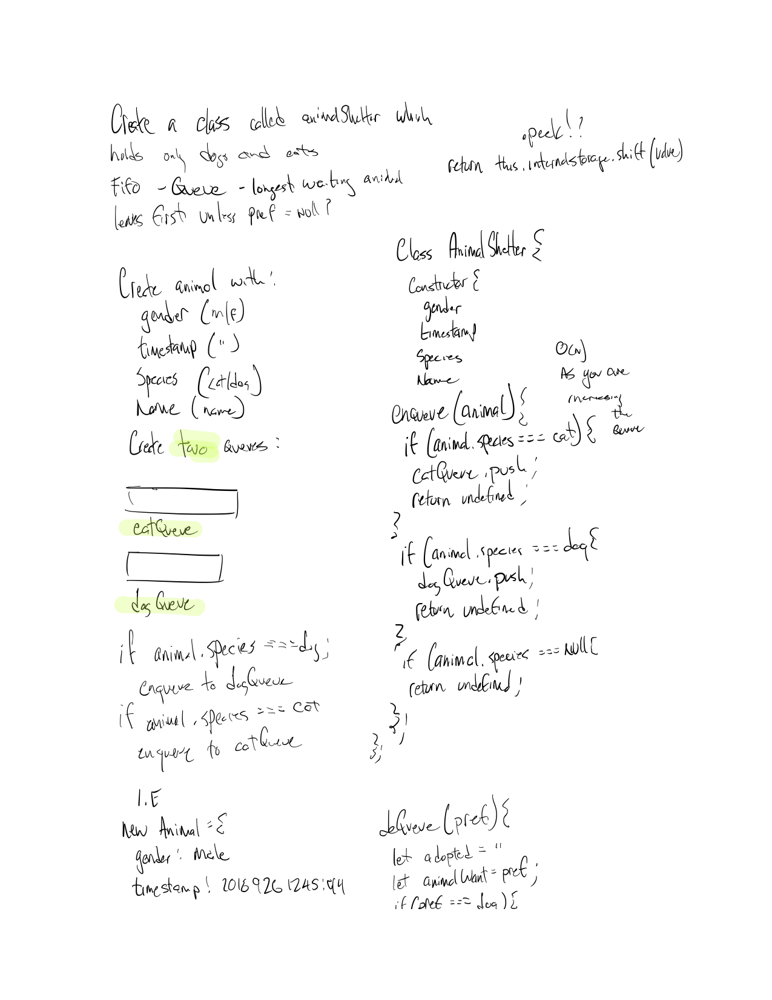
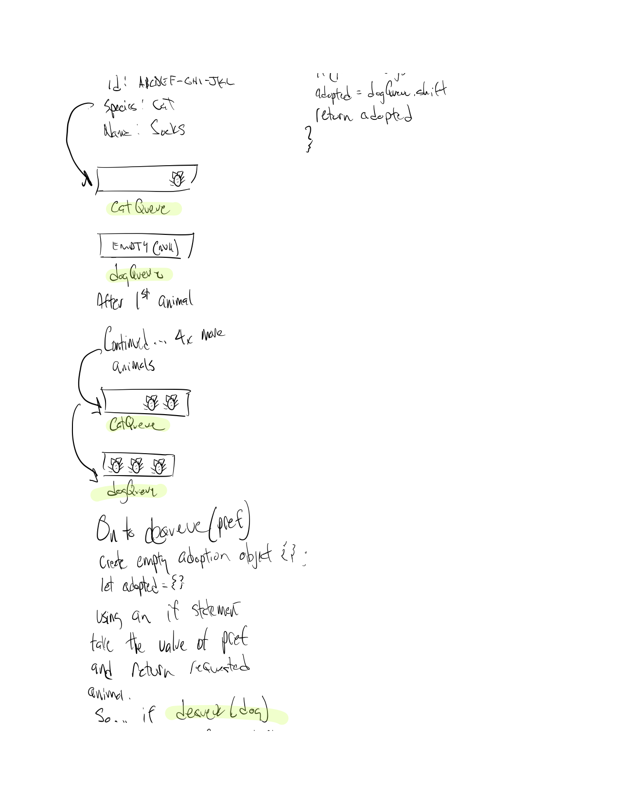
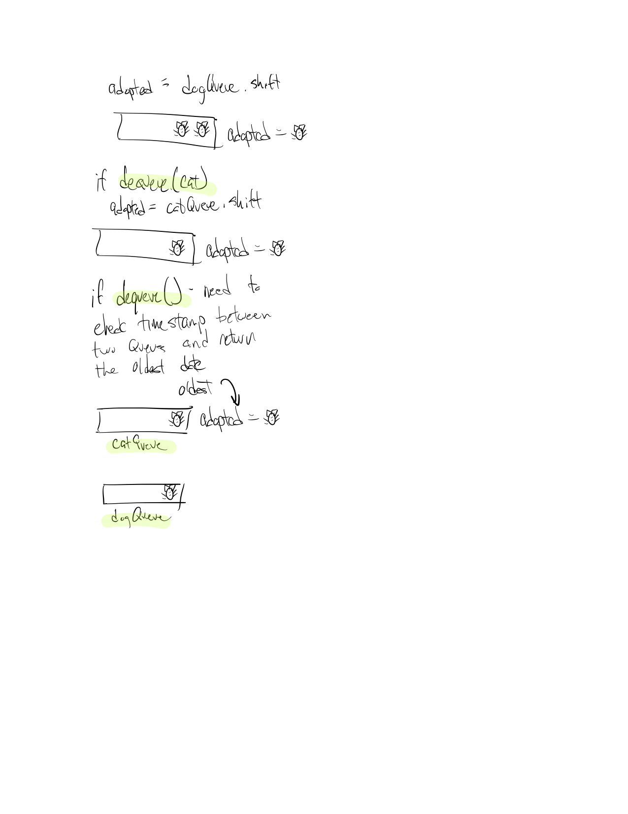

# Animal Shelter

Create a class called AnimalShelter which holds only dogs and cats. The shelter operates using a first-in, first-out approach.

# Author / Version

Daniel Frey / 1.0.0

# Travis CI

## Challenge

Implement the following methods:
``enqueue(animal):`` adds ``animal`` to the shelter. ``animal`` can be either a dog or a cat object.
``dequeue(pref):`` returns either a dog or a cat. If ``pref``, a string, is ‘cat’ return the longest-waiting cat. If ``pref`` is ‘dog’, return the longest-waiting dog. For anything else, return either a cat or a dog.

## Solution

