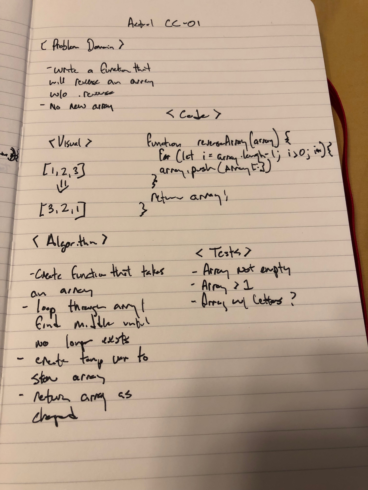

# Reverse an Array

Take in an array as given and return the reverse of the array.

## Challenge

.reverse is not allowed in this challenge

## Example

Input:
    
    [1, 2, 3, 4]

Output:

    [4, 3, 2, 1]

## Solution

