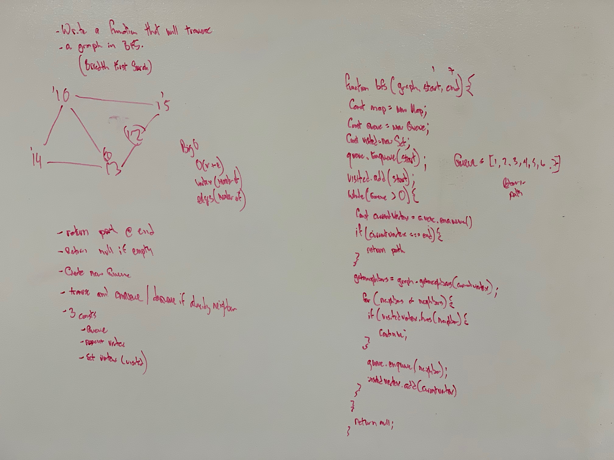

# Breadth First Search (graphs)

Traverse a graph using BFS

# Author / Version

Daniel Frey / 1.0.0

# Travis CI

## Challenge

Write a function that will traverse a graph in Breadth First Search and return the path from beginning to end.

## Solution

