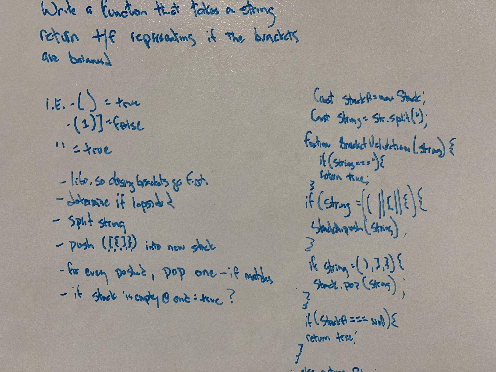

# Bracket Validation

# Author / Version

Daniel Frey 1.0.0

# Travis CI

## Challenge

Create a function that will take a string and validate whether or not the brackets (if any) match on both sides of said string.
## Running the test
Clone and download this repo, run npm -i to install the dependencies, navigate to the correct folder in the repo and run "npm run test"

## Solution

