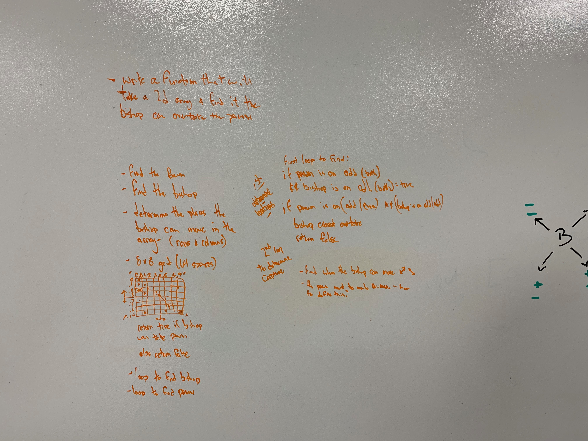

# Capture The Pawn

# Author / Version

Daniel Frey 1.0.0

# Travis CI

## Challenge

Create a function that given a 2d array will find whether a bishop is able to capture a pawn. Return true or false
## Running the test
Clone and download this repo, run npm -i to install the dependencies, navigate to the correct folder in the repo and run "npm run test"

## Solution

by checking the columns and rows in both +/- directions of travel you can determine whether or not the pawn may be captured

