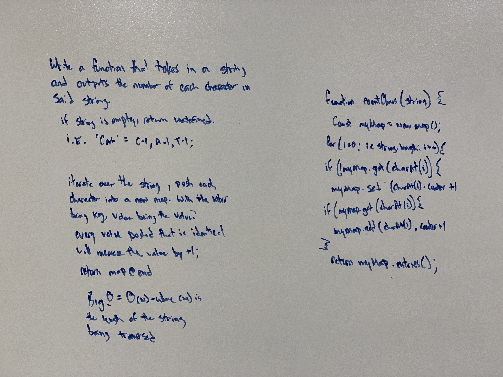

# Count the Characters

# Author / Version

Daniel Frey 1.0.0

# Travis CI

## Challenge
Create a function that takes in a string and counts the number of unique characters in said string. Return the total character values.

## Running the test
Clone and download this repo, run npm -i to install the dependencies, navigate to the correct folder in the repo and run "npm run test"

## Solution

By creating a hashmap you can store key / value pairs for each unique letter. When a duplicate letter is found, the value in the map will increase.

