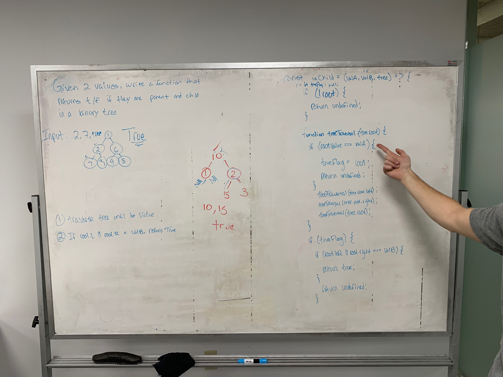

# Find child

Create a function that given two values which return true / false if they are parent and child in a binary tree.
# Author / Version

Daniel Frey / Tom North 1.0.0

# Travis CI

## Challenge

 ​Create a function that given two values which return true / false if they are parent and child in a binary tree.

## Running the test
Clone and download this repo, run npm -i to install the dependencies, navigate to the correct folder in the repo and run "npm run test"

## Solution

