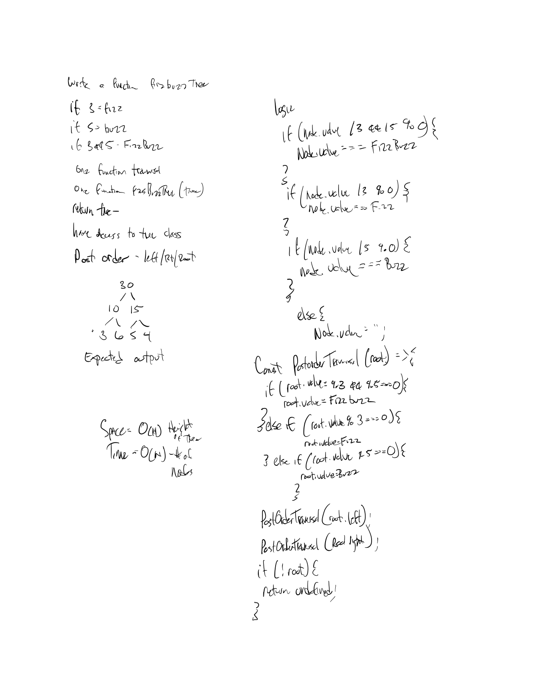

# Binary Tree Traversal

Conduct “FizzBuzz” on a tree while traversing through it. Change the values of each of the nodes dependent on the current node’s value

# Author / Version

Daniel Frey / 1.0.0

# Travis CI

## Challenge

Write a function called ``FizzBuzzTree`` which takes a tree as an argument.
Without utilizing any of the built-in methods available to your language, determine weather or not the value of each node is divisible by 3, 5 or both, and change the value of each of the nodes respectively. Return the tree with it’s news values.
   
## Solution

