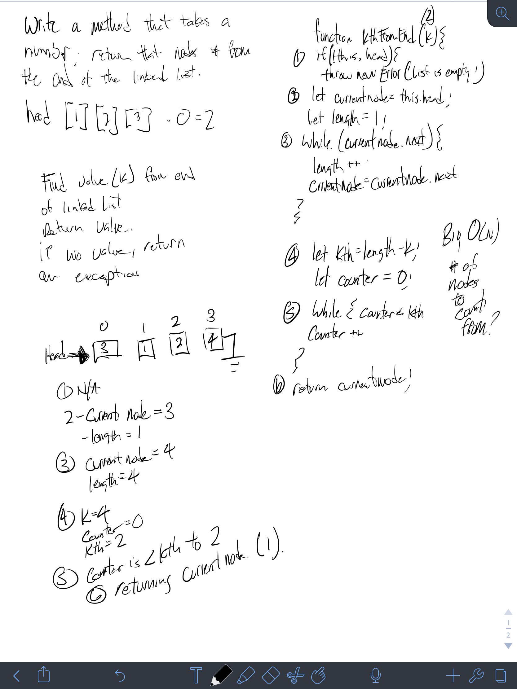

# Linked List Insertions (2)

Create prototype that searches from the end on the LinkedList (LL) class.

# Author / Version

Daniel Frey / 1.0.0

# Travis CI

## Challenge

Write a method for the Linked List class which takes a number, `k`, as a parameter. 
Return the node’s value that is `k` from the end of the linked list. 
You have access to the Node class and all the properties on the Linked List 
class as well as the methods created in previous challenges. ​

## Examples

#### kthFromEnd(value)
    Input                  Args  Output
    head->[1]->[2]->[3] ->  X      [2] 
   
## Solution

