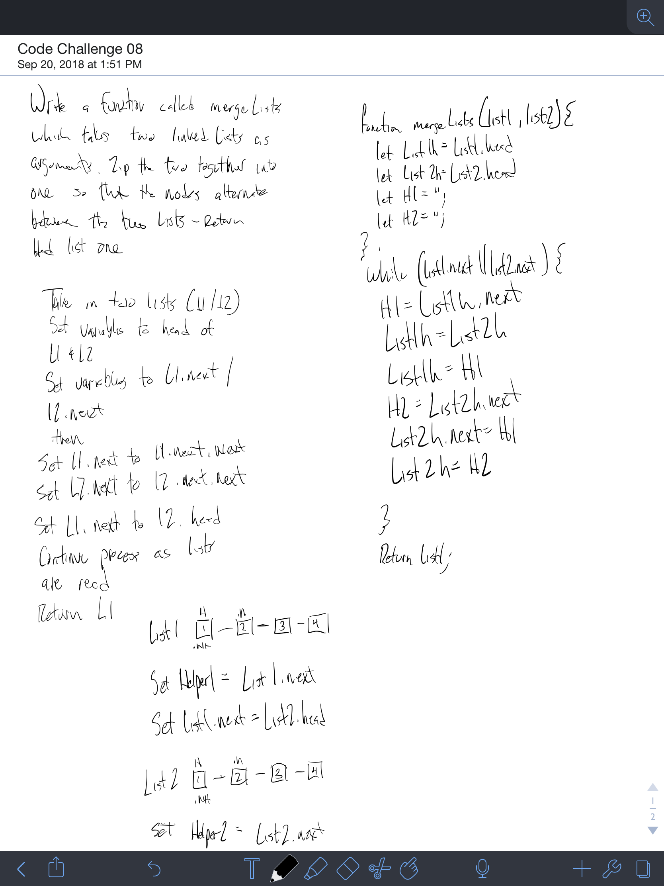

# Linked List Merge
Create a prototype that will take two linked lists and merge them together in a zipper like fashion.
# Author / Version

Daniel Frey / 1.0.0

# Travis CI

## Challenge

Write a function called `mergeLists` which takes two linked lists as arguments. 
Zip the two linked lists together into one so that the nodes alternate between 
the two lists and return a reference to the head of the zipped list. 
Try and keep additional space down to O(1). 
You have access to the Node class and all the properties on the Linked List class as 
well as the methods created in previous challenges.

## Examples

#### ll-merge
    Input                         Output
    head->[1]->[3]->[2]-> X     head -> [1] -> [5] -> [3] -> [9] -> [2] -> [4] -> X
    head->[5]->[9]->[4]-> X
   
## Solution

