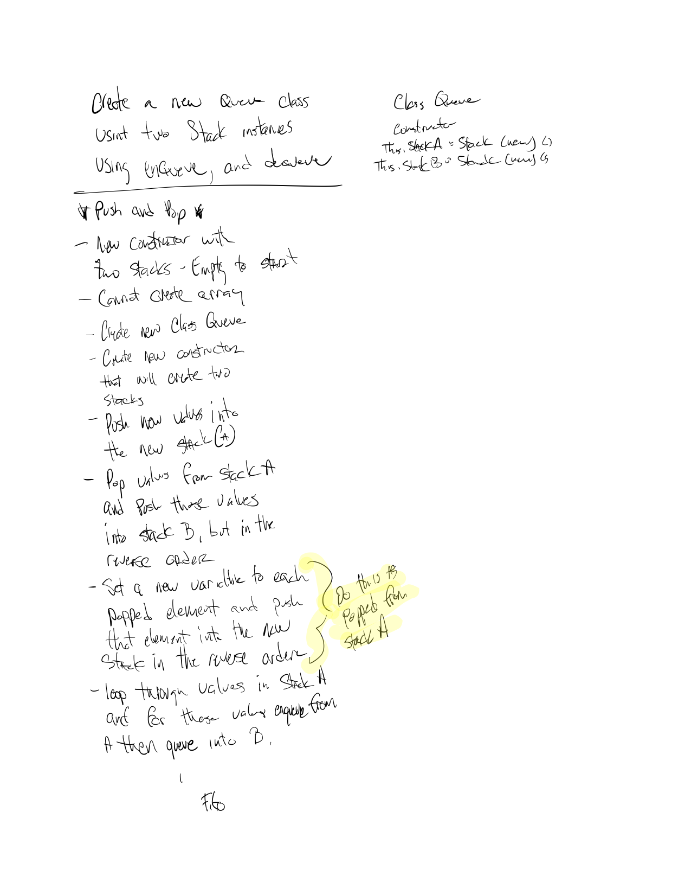

# Stacks and Queues

Create a new ``Queue`` class. Using two ``Stack`` instances, implement this Queue with the following methods:.
``enqueue(value)``  which inserts value into the Queue using a first-in, first-out approach.
``dequeue()`` which extracts a value from the Queue using a first-in, first-out approach.
The Stack instances have only push and pop methods, and a size property. Instantiate these Stack objects in your Queue constructor
# Author / Version

Daniel Frey / 1.0.0

# Travis CI

## Challenge

Write a method for the Linked List class which takes a number, `k`, as a parameter. 
Return the node’s value that is `k` from the end of the linked list. 
You have access to the Node class and all the properties on the Linked List 
class as well as the methods created in previous challenges. ​

## Examples

#### enqueue
    Input                  Args     Output
     [10]->[15]->[20]      5        [5]->[10]->[15]->[20] 
      
#### dequeue
    Input                  Args     Internal State
     [5]->[10]->[15]->[20] 20       [5]->[10]->[15])
## Solution

[whiteboard solution2](whiteboard2.png)
[whiteboard solution3](whiteboard3.png)

