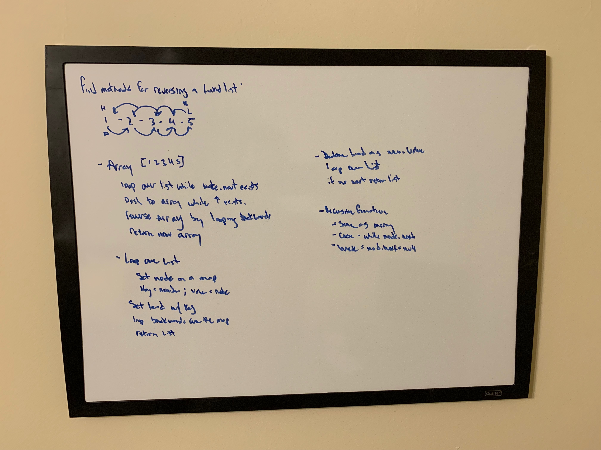

# Linked List Reversals and Balanced Binary tree

This is for two separate tasks:
1. Write three different functions for reversing a linked list
2. Write a function that returns true if a binary tree is balanced.

#### To run all tests:
```
npm run test
```


